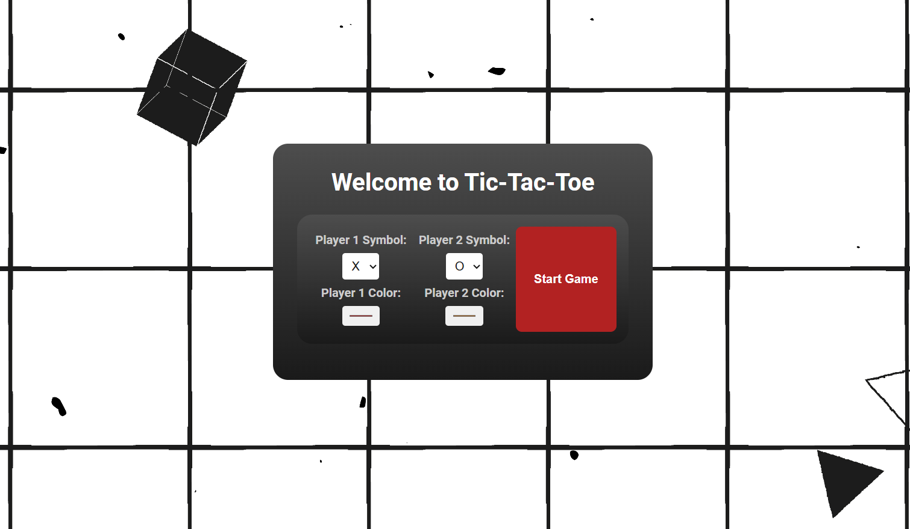
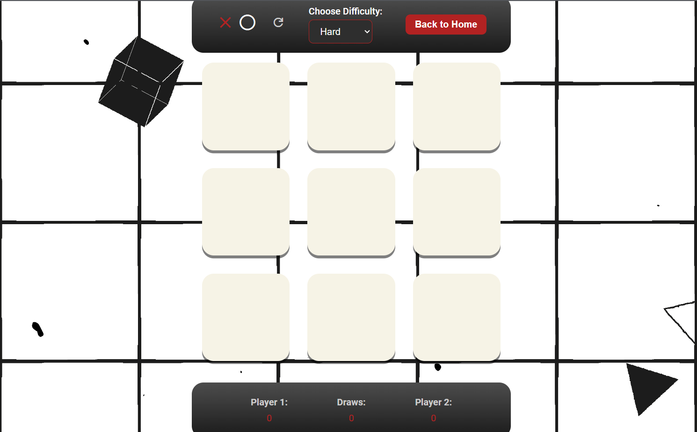

# 🎯 Tic-Tac-Toe Game

## 📖 Overview

This is a classic Tic-Tac-Toe game implemented using HTML, CSS, and JavaScript. It features a responsive design and customizable game settings including difficulty levels and player symbols. The game can be played against the computer or with another player.

---

## 🚀 Installation

To get started with the project, follow these steps:

1. **Clone the repository**:
    ```bash
    git clone https://github.com/DenislavaVM/TicTacToe.git
    ```

2. **Navigate into the project directory**:
    ```bash
    cd TicTacToe
    ```

3. **Open the project in your preferred code editor**.

---

## 🛠️ Usage

1. **Start the game**:
   Open `index.html` in your web browser.

2. **Customize Game Settings**:
   - Choose player symbols.
   - Set the difficulty level for playing against the computer.

3. **Play the Game**:
   - Click on the cells to place your symbol.
   - The game will automatically switch turns between the player and the computer or the other player.

4. **Reset the Game**:
   - Click the "Reset" button to start a new game.

5. **Go Back to Home Screen**:
   - Click the "Back to Home" button to return to the home screen.

---

## 📷 Screenshots

### Home Screen


### Gameplay


---

## 📂 Files

- **`index.html`**: Main HTML file for the game.
- **`style.css`**: CSS file for styling the game.
- **`script.js`**: JavaScript file containing the game logic.

---

## 💬 Feedback

If you have any questions or feedback, feel free to open an issue on [GitHub Issues](https://github.com/DenislavaVM/TicTacToe/issues).

---

## 📄 License

This project is licensed under the MIT License - see the [LICENSE](LICENSE.txt) file for details.

## 🛠️ Technologies Used

- HTML
- CSS
- JavaScript

---
