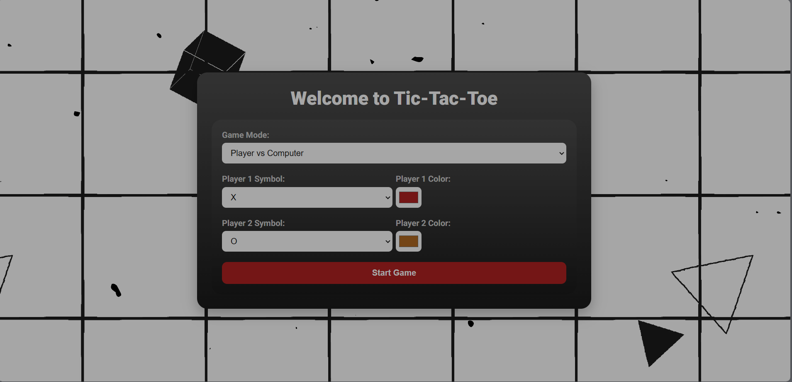
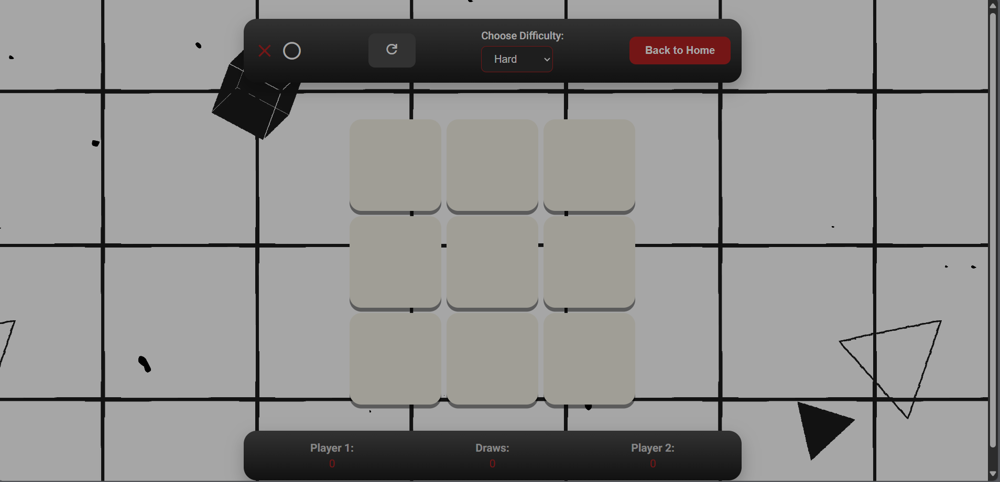

# 🎯 Tic-Tac-Toe Game

[Play the Game Now! 🚀](https://denislavavm.github.io/TicTacToe/)

[](./LICENSE.txt)
[](https://github.com/DenislavaVM/TicTacToe)
[](https://developer.mozilla.org/en-US/docs/Web/JavaScript)
[](https://github.com/DenislavaVM/TicTacToe/pulls)

---

## ✨ Features
- Player vs Player and Player vs Computer
- AI difficulty: Easy, Medium, Hard (Minimax)
- Customizable symbols and colors
- Sound effects and animations
- Keyboard accessibility
- Responsive design for all devices

---

## 📖 Overview

Tic-Tac-Toe is a timeless strategy game reimagined with modern web technologies. Built using HTML, CSS, and JavaScript, this project supports both PvP and PvC gameplay, offers rich customization, AI difficulty settings, and full keyboard accessibility.

---

## 🚀 Installation

To get started with the project, follow these steps:

1. **Clone the repository**:
    ```bash
    git clone https://github.com/DenislavaVM/TicTacToe.git
    ```

2. **Navigate into the project directory**:
    ```bash
    cd TicTacToe
    ```

3. **Start the game**:
   Open `index.html` in your browser, or use a local server like Live Server in VSCode.

---

## 🕹️ How to Play

1. **Customize settings** on the home screen:
   - Game mode: PvP or PvC
   - Player symbols: X or O
   - Player colors
   - AI difficulty (Easy / Medium / Hard)

2. **Click "Start Game"** to begin.

3. **Use mouse or keyboard** (arrow keys + Enter/Space) to make moves.

4. **Click "Reset"** to restart or **"Back to Home"** to change settings.

---

## 📷 Screenshots

### Home Screen


### Gameplay


---

## 💡 Technologies Used

- **HTML5**
- **CSS3**: Flexbox, animations, media queries
- **JavaScript**:
  - ES6 Modules
  - Web Workers for non-blocking AI
  - DOM manipulation
  - LocalStorage for score tracking

---

## 💬 Feedback

If you have any questions or feedback, feel free to open an issue on [GitHub Issues](https://github.com/DenislavaVM/TicTacToe/issues).

---

## 📄 License

This project is licensed under the MIT License - see the [LICENSE](LICENSE.txt) file for details.